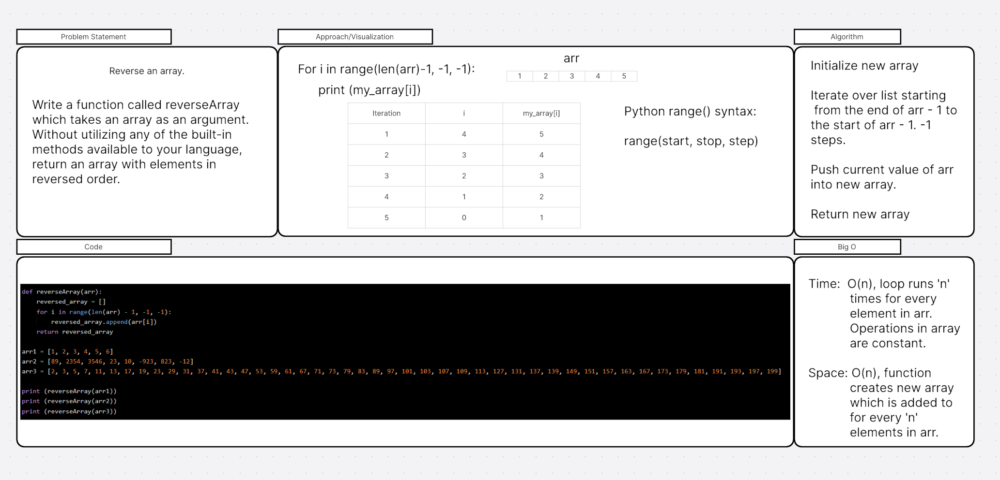

# Array Reverse

Write a function called reverseArray which takes an array as an argument. Without utilizing any of the built-in methods available to your language, return an array with elements in reversed order.

## Whiteboard Process
<!-- Embedded whiteboard image -->

## Approach & Efficiency
<!-- What approach did you take? Why? What is the Big O space/time for this approach? -->
I used a for loop approach because it seemed like the simplest solution to the task. The for loop looks for every i in a range of length of array - 1 to -1, and iterates by steps of -1.
Big O should be O(n) for both space and time. Adds n items to array for space, and iterates n times for time. 

## Solution
<!-- Show how to run your code, and examples of it in action -->
> def reverseArray(arr):  
> &nbsp;&nbsp;reversed_array = []  
> &nbsp;&nbsp;for i in range(len(arr) - 1, -1, -1):  
> &nbsp;&nbsp;&nbsp;&nbsp;reversed_array.append(arr[i])  
> &nbsp;&nbsp;return reversed_array  