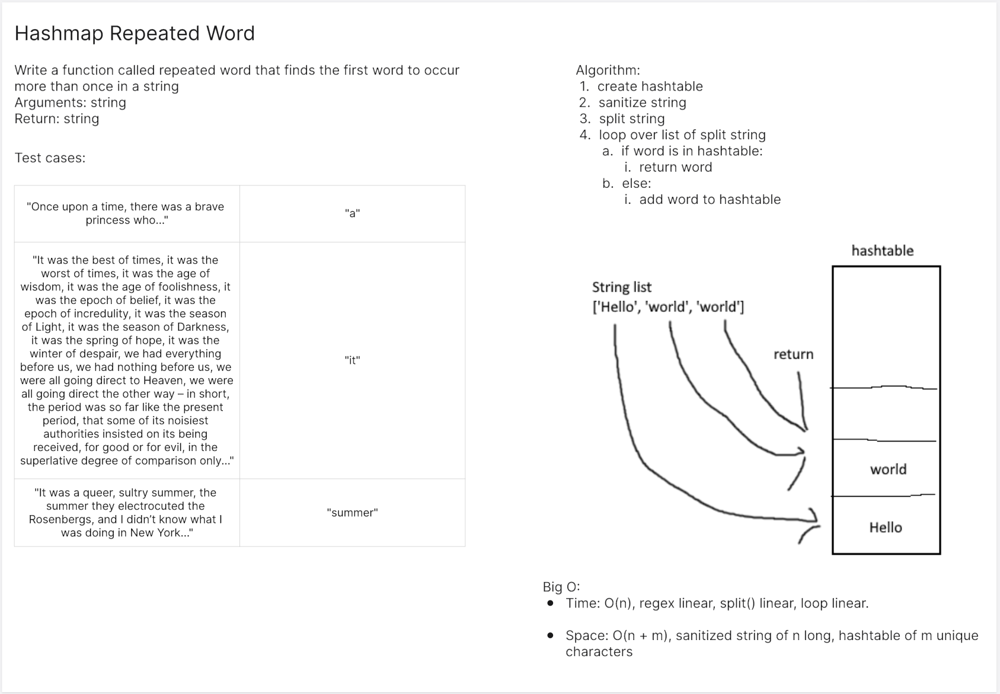
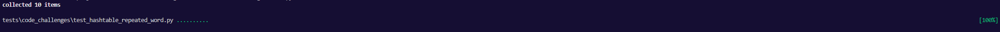

# Hashtable Repeated Word
<!-- Description of the challenge -->
Write a function called repeated word that finds the first word to occur more than once in a string

## Whiteboard Process
<!-- Embedded whiteboard image -->


## Approach & Efficiency
<!-- What approach did you take? Why? What is the Big O space/time for this approach? -->

Big O:

- Time: O(n)
- Space: O(n + m)

## Solution
<!-- Show how to run your code, and examples of it in action -->
```
def first_repeated_word(str):
    ht = Hashtable()

    for word in re.sub(r"[^A-Za-z0-9 ]+", '', str).split():
        if ht.has(word.lower()):
            if ht.get(word.lower()) > 0:
                return word.lower()
        else:
            ht.set(word.lower(), 1)
```

Tests:
```
def test_blank():
    actual = first_repeated_word("")
    expected = None
    assert actual == expected


# @pytest.mark.skip("TODO")
def test_no_repeat():
    actual = first_repeated_word("nobody here but us chickens")
    expected = None
    assert actual == expected


# @pytest.mark.skip("TODO")
def test_a_a():
    actual = first_repeated_word("apple apple")
    expected = "apple"
    assert actual == expected


# @pytest.mark.skip("TODO")
def test_a_b_a():
    actual = first_repeated_word("apple banana apple")
    expected = "apple"
    assert actual == expected


# @pytest.mark.skip("TODO")
def test_a_b_a_b():
    actual = first_repeated_word("apple banana apple banana")
    expected = "apple"
    assert actual == expected


# @pytest.mark.skip("TODO")
def test_a_b_b_a():
    actual = first_repeated_word("apple banana banana apple")
    expected = "banana"
    assert actual == expected


# @pytest.mark.skip("TODO")
def test_ignore_case():
    actual = first_repeated_word("apple banana BANANA apple")
    expected = "banana"
    assert actual == expected


# @pytest.mark.skip("TODO")
def test_ignore_case_flipped():
    actual = first_repeated_word("apple BANANA banana apple")
    expected = "banana"
    assert actual == expected


# @pytest.mark.skip("TODO")
def test_punctuation():
    actual = first_repeated_word("apple? BANANA! banana, apple.")
    expected = "banana"
    assert actual == expected


# @pytest.mark.skip("TODO")
def test_punctuation_joins():
    txt = """
  apple
  apple.apple-apple
  banana
  apple?apple
  banana
  """

    actual = first_repeated_word(txt)
    expected = "banana"
    assert actual == expected

```
