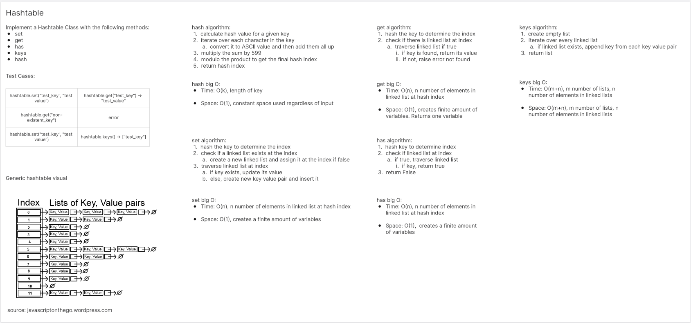
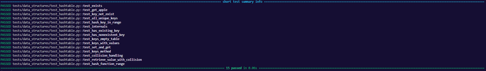

# Hashtable
<!-- Description of the challenge -->
Implement a hashtable

## Whiteboard Process
<!-- Embedded whiteboard image -->


## Approach & Efficiency
<!-- What approach did you take? Why? What is the Big O space/time for this approach? -->

Big O:

- hash:
    - Time: O(k)
    - Space: Constant
- set:
    - Time: O(n)
    - Space: Constant
- get:
    - Time: O(n)
    - Space: Constant
- has:
    - Time: O(n)
    - Space: Constant
- keys:
    - Time: O(m+n)
    - Space: O(m+n)

## Solution
<!-- Show how to run your code, and examples of it in action -->
```
from code_challenges.linked_list.linked_list import Linked_List

class Hashtable:
    def __init__(self, size=1024):
        self._size = size
        self._tables = [None] * size

    def hash(self, key):
        index = 0
        for char in key:
            index += ord(char)
        index *= 599
        index = index % self._size
        return index

    def set(self, key, value):
        index = self.hash(key)
        table = self._tables[index]
        if table is None:
            table = Linked_List()
            self._tables[index] = table
        current = table.head

        while current:
            candidate_leg = current.data
            if candidate_leg[0] == key:
                candidate_leg[1] = value
                return
            current = current.next

        leg = [key, value]
        table.insert(leg)

    def get(self, key):
        index = self.hash(key)
        table = self._tables[index]
        if table is not None:
            current = table.head
            while current:
                candidate_leg = current.data
                if candidate_leg[0] == key:
                    return candidate_leg[1]
                current = current.next
        raise KeyError(f"Key '{key}' not found in the hashtable.")

    def has(self, key):
        index = self.hash(key)
        table = self._tables[index]
        if table is not None:
            current = table.head
            while current:
                if current.data[0] == key:
                    return True
                current = current.next
        return False

    def keys(self):
        all_keys = []
        for table in self._tables:
            if table is not None:
                current = table.head
                while current:
                    all_keys.append(current.data[0])
                    current = current.next
        return all_keys
```

Tests:
```
def test_exists():
    assert Hashtable

# @pytest.mark.skip("TODO")
def test_get_apple():
    hashtable = Hashtable()
    hashtable.set("apple", "Used for apple sauce")
    actual = hashtable.get("apple")
    expected = "Used for apple sauce"
    assert actual == expected

def test_key_not_exist():
    hashtable = Hashtable()
    with pytest.raises(KeyError):
        hashtable.get("nonexistent_key")

def test_all_unique_keys():
    hashtable = Hashtable()
    hashtable.set("apple", "Used for apple sauce")
    hashtable.set("banana", "Yellow fruit")
    hashtable.set("orange", "Citrus fruit")
    actual = hashtable.keys()
    expected = ["apple", "banana", "orange"]
    assert sorted(actual) == expected

def test_hash_key_in_range():
    hashtable = Hashtable(1024)
    key = "apple"

    actual = hashtable.hash(key)
    assert 0 <= actual < 1024

# @pytest.mark.skip("TODO")
def test_internals():
    hashtable = Hashtable(1024)
    hashtable.set("ahmad", 30)
    hashtable.set("silent", True)
    hashtable.set("listen", "to me")

    actual = []

    # NOTE: purposely breaking encapsulation to test the "internals" of Hashmap
    for item in hashtable._tables:
        if item:
            actual.append(sorted(item.display()))

    expected = [sorted([["silent", True], ["listen", "to me"]]), sorted([["ahmad", 30]])]

    assert actual == expected

def test_has_existing_key():
    hashtable = Hashtable()
    hashtable.set("apple", "Used for apple sauce")
    assert hashtable.has("apple") is True

def test_has_nonexistent_key():
    hashtable = Hashtable()
    assert hashtable.has("nonexistent_key") is False

def test_keys_empty_table():
    hashtable = Hashtable()
    assert hashtable.keys() == []

def test_keys_with_values():
    hashtable = Hashtable()
    hashtable.set("apple", "Used for apple sauce")
    hashtable.set("banana", "Yellow fruit")
    hashtable.set("orange", "Citrus fruit")
    assert sorted(hashtable.keys()) == ["apple", "banana", "orange"]

@pytest.fixture
def empty_hashtable():
    return Hashtable()

@pytest.fixture
def hashtable_with_data():
    ht = Hashtable()
    ht.set("key1", "value1")
    ht.set("key2", "value2")
    ht.set("key3", "value3")
    return ht

def test_set_and_get(empty_hashtable):
    empty_hashtable.set("test_key", "test_value")
    assert empty_hashtable.get("test_key") == "test_value"

def test_key_not_exist(empty_hashtable):
    with pytest.raises(KeyError):
        empty_hashtable.get("nonexistent_key")

def test_keys_method(hashtable_with_data):
    keys = hashtable_with_data.keys()
    assert set(keys) == {"key1", "key2", "key3"}

def test_collision_handling(empty_hashtable):
    key1 = "abc"
    key2 = "bca"
    index1 = empty_hashtable.hash(key1)
    index2 = empty_hashtable.hash(key2)
    assert index1 == index2

    empty_hashtable.set(key1, "value1")
    empty_hashtable.set(key2, "value2")

    assert empty_hashtable.get(key1) == "value1"
    assert empty_hashtable.get(key2) == "value2"

def test_retrieve_value_with_collision(hashtable_with_data):
    key1 = "abc"
    key2 = "bca"
    index = hashtable_with_data.hash(key1)
    assert index == hashtable_with_data.hash(key2)

    hashtable_with_data.set(key1, "new_value")

    assert hashtable_with_data.get(key1) == "new_value"

    with pytest.raises(KeyError):
        hashtable_with_data.get(key2)


def test_hash_function_range(empty_hashtable):
    key = "test_key"
    hashed_index = empty_hashtable.hash(key)
    assert 0 <= hashed_index < empty_hashtable._size
```
