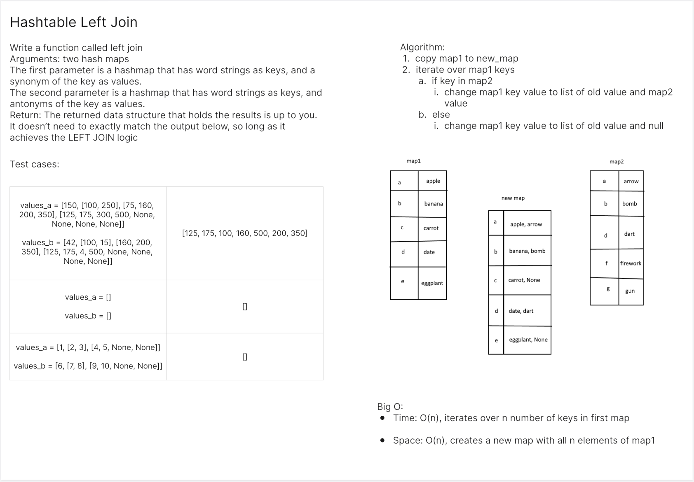
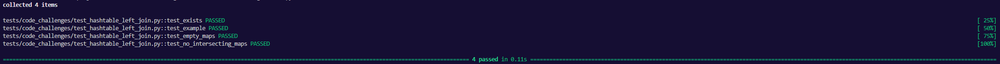

# Hashtable Left Join
<!-- Description of the challenge -->
Implement a simplified LEFT JOIN for 2 Hashmaps.

## Whiteboard Process
<!-- Embedded whiteboard image -->


## Approach & Efficiency
<!-- What approach did you take? Why? What is the Big O space/time for this approach? -->

Big O:

- Time: O(n)
- Space: O(n)

## Solution
<!-- Show how to run your code, and examples of it in action -->
```
def left_join(map1, map2):
    return_map = map1
    for key in map1:
        if key in map2:
            return_map[key] = [map1.get(key), map2.get(key)]
        else:
            return_map[key] = [map1.get(key), None]
    return return_map
```

Tests:
```
def test_exists():
    assert left_join


# @pytest.mark.skip("TODO")
def test_example():
    synonyms = {
        "diligent": "employed",
        "fond": "enamored",
        "guide": "usher",
        "outfit": "garb",
        "wrath": "anger",
    }
    antonyms = {
        "diligent": "idle",
        "fond": "averse",
        "guide": "follow",
        "flow": "jam",
        "wrath": "delight",
    }

    expected = {
        'diligent': ['employed', 'idle'], 
        'fond': ['enamored', 'averse'], 
        'guide': ['usher', 'follow'], 
        'outfit': ['garb', None], 
        'wrath': ['anger', 'delight']
        }

    actual = left_join(synonyms, antonyms)

    assert actual == expected

def test_empty_maps():
    map1 = {}
    map2 = {}
    expected = {}
    actual = left_join(map1, map2)
    assert actual == expected

def test_no_intersecting_maps():
    map1 = {"a": 1, "b": 2, "c": 3}
    map2 = {"x": 10, "y": 20, "z": 30}
    expected = {"a": [1, None], "b": [2, None], "c": [3, None]}
    actual = left_join(map1, map2)
    assert actual == expected
```
