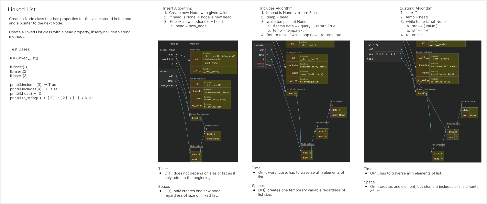

# Linked List
<!-- Description of the challenge -->
Implement a linked list

## Whiteboard Process
<!-- Embedded whiteboard image -->


## Approach & Efficiency
<!-- What approach did you take? Why? What is the Big O space/time for this approach? -->
I'm sure I took a rather simple approach. Nodes connect to each other upon insert.

Big O:

- insert:
  - Time: Constant
  - Space: Constant
- includes:
  - Time: O(n)
  - Space: Constant
- to_string:
  - Time: O(n)
  - Space: O(n)

## Solution
<!-- Show how to run your code, and examples of it in action -->
```
class Node:
    def __init__(self, data, next=None):
        self.data = data
        self.next = next
    
    def __str__(self):
        return str(self.data)
        
class Linked_List:
    def __init__(self):
        self.head = None
        
    def insert(self, data):
        new_node = Node(data)
        if self.head is None:
            self.head = new_node
            return
        else:
            new_node.next = self.head
            self.head = new_node
    
    def includes(self, data):
        if self.head is None:
            return False
        else:
            i = self.head
            while i is not None:
                if i.data == data:
                    return True
                i = i.next
            return False
            
    def to_string(self):
        res = ""
        node = self.head
        
        while node:
            res += "{ " + str(node.data) + " }"
            if node.next is None:
                res += " -> NULL"
            else:
                res += " -> "
            node = node.next
        return res
```