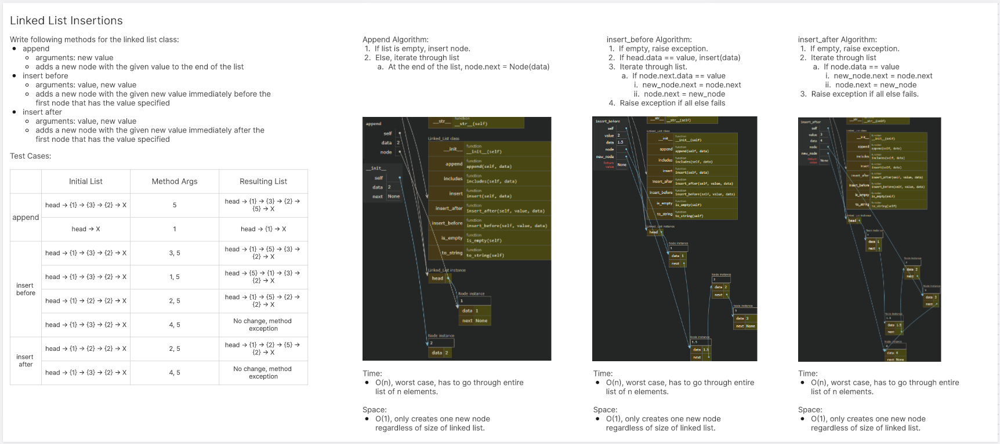

# Linked List
<!-- Description of the challenge -->
Futher implement a linked list.

## Whiteboard Process
<!-- Embedded whiteboard image -->


## Approach & Efficiency
<!-- What approach did you take? Why? What is the Big O space/time for this approach? -->
Just your typical while loop iterations.

Big O:

- append:
  - Time: O(n)
  - Space: Constant
- insert_before:
  - Time: O(n)
  - Space: Constant
- insert_after:
  - Time: O(n)
  - Space: Constant

## Solution
<!-- Show how to run your code, and examples of it in action -->
### linked_list.py
```
class Node:
  def __init__(self, data, next=None):
    self.data = data
    self.next = next
  
  def __str__(self):
    return str(self.data)
        
class Linked_List:
  def __init__(self):
    self.head = None
      
  def insert(self, data):
    new_node = Node(data)
    if self.head is None:
      self.head = new_node
      return
    else:
      new_node.next = self.head
      self.head = new_node
  
  def includes(self, data):
    if self.head is None:
      return False
    else:
      i = self.head
      while i is not None:
        if i.data == data:
            return True
        i = i.next
      return False
          
  def to_string(self):
    res = ""
    node = self.head
    
    while node:
      res += "{ " + str(node.data) + " }"
      if node.next is None:
        res += " -> NULL"
      else:
        res += " -> "
      node = node.next
    return res
  
  def is_empty(self):
    return self.head == None
  
  def append(self, data):
    if self.head == None:
      self.insert(data)
    else:
      node = self.head
      while node.next is not None:
        node = node.next
      node.next = Node(data)
  
  def insert_before(self, value, data):
    if self.is_empty():
      raise Exception("List is empty")
    
    if self.head.data == value:
      self.insert(data)
      return

    node = self.head
    while node.next is not None:
      if node.next.data == value:
        new_node = Node(data)
        new_node.next = node.next
        node.next = new_node
        return
      node = node.next
    raise Exception("Value not found in list")
  
  def insert_after(self, value, data):
    if self.is_empty():
      raise Exception("List is empty")

    node = self.head
    while node:
      if node.data == value:
        new_node = Node(data)
        new_node.next = node.next
        node.next = new_node
        return
      node = node.next
    raise Exception("Value not found in list")
```
### test_linked_list.py
```
import pytest
from code_challenges.linked_list.linked_list import Linked_List, Node

def test_add_node_to_end():
    ll = Linked_List()
    ll.append(1)
    assert ll.to_string() == "{ 1 } -> NULL"

def test_add_multiple_nodes_to_end():
    ll = Linked_List()
    ll.append(1)
    ll.append(2)
    assert ll.to_string() == "{ 1 } -> { 2 } -> NULL"

def test_insert_node_before_middle():
    ll = Linked_List()
    ll.append(1)
    ll.append(2)
    ll.append(3)
    ll.insert_before(2, 1.5)
    assert ll.to_string() == "{ 1 } -> { 1.5 } -> { 2 } -> { 3 } -> NULL"

def test_insert_node_before_first():
    ll = Linked_List()
    ll.append(1)
    ll.insert_before(1, 0)
    assert ll.to_string() == "{ 0 } -> { 1 } -> NULL"

def test_insert_node_before_end():
    ll = Linked_List()
    ll.append(1)
    ll.append(2)
    ll.append(3)
    ll.insert_before(3, 4)
    assert ll.to_string() == "{ 1 } -> { 2 } -> { 4 } -> { 3 } -> NULL"

def test_insert_node_after_middle():
    ll = Linked_List()
    ll.append(1)
    ll.append(2)
    ll.append(3)
    ll.insert_after(2, 2.5)
    assert ll.to_string() == "{ 1 } -> { 2 } -> { 2.5 } -> { 3 } -> NULL"

def test_insert_node_after_last():
    ll = Linked_List()
    ll.append(1)
    ll.append(2)
    ll.append(3)
    ll.insert_after(3, 4)
    assert ll.to_string() == "{ 1 } -> { 2 } -> { 3 } -> { 4 } -> NULL"
```

### Rite of Passage
