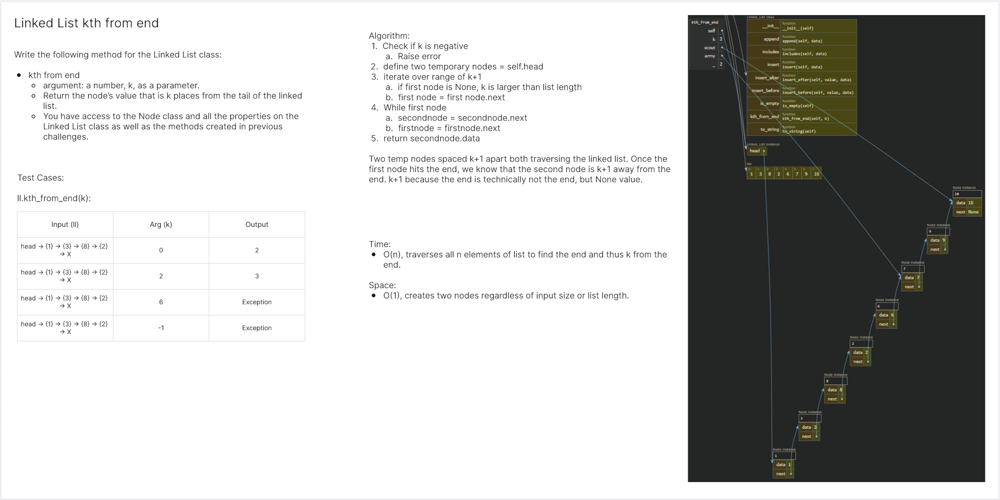

# Linked List
<!-- Description of the challenge -->
Futher implement a linked list.

## Whiteboard Process
<!-- Embedded whiteboard image -->


## Approach & Efficiency
<!-- What approach did you take? Why? What is the Big O space/time for this approach? -->
Double traversal nodes spaced ~k apart to find k from the end. Seemed better than using one traversal node twice. 

Big O:

- kth_from_end:
  - Time: O(n)
  - Space: Constant

## Solution
<!-- Show how to run your code, and examples of it in action -->
### linked_list.py
```
class Node:
  def __init__(self, data, next=None):
    self.data = data
    self.next = next
  
  def __str__(self):
    return str(self.data)
        
class Linked_List:
  def __init__(self):
    self.head = None
      
  def insert(self, data):
    new_node = Node(data)
    if self.head is None:
      self.head = new_node
      return
    else:
      new_node.next = self.head
      self.head = new_node
  
  def includes(self, data):
    if self.head is None:
      return False
    else:
      i = self.head
      while i is not None:
        if i.data == data:
            return True
        i = i.next
      return False
          
  def to_string(self):
    res = ""
    node = self.head
    
    while node:
      res += "{ " + str(node.data) + " }"
      if node.next is None:
        res += " -> NULL"
      else:
        res += " -> "
      node = node.next
    return res
  
  def is_empty(self):
    return self.head == None
  
  def append(self, data):
    if self.head == None:
      self.insert(data)
    else:
      node = self.head
      while node.next is not None:
        node = node.next
      node.next = Node(data)
  
  def insert_before(self, value, data):
    if self.is_empty():
      raise Exception("List is empty")
    
    if self.head.data == value:
      self.insert(data)
      return

    node = self.head
    while node.next is not None:
      if node.next.data == value:
        new_node = Node(data)
        new_node.next = node.next
        node.next = new_node
        return
      node = node.next
    raise Exception("Value not found in list")
  
  def insert_after(self, value, data):
    if self.is_empty():
      raise Exception("List is empty")

    node = self.head
    while node:
      if node.data == value:
        new_node = Node(data)
        new_node.next = node.next
        node.next = new_node
        return
      node = node.next
    raise Exception("Value not found in list")

  def kth_from_end(self, k):
    if k < 0:
      raise IndexError("Invalid Negative Value")
    scout = army = self.head

    for _ in range(k+1):
      if scout is None:
        raise IndexError("K is greater than list length")
      scout = scout.next

    while scout:
      army = army.next
      scout = scout.next

    return army.data
  

```
### test_linked_list.py
```
import pytest
from code_challenges.linked_list.linked_list import Linked_List


# @pytest.mark.skip("TODO")
def test_kth_from_end_zero():
    linked_list = Linked_List()
    values = ["apples", "bananas", "cucumbers"]
    for value in reversed(values):
        linked_list.insert(value)
    actual = linked_list.kth_from_end(0)
    expected = "cucumbers"
    assert actual == expected


# @pytest.mark.skip("TODO")
def test_kth_from_end_one():
    linked_list = Linked_List()
    values = ["apples", "bananas", "cucumbers"]
    for value in reversed(values):
        linked_list.insert(value)
    actual = linked_list.kth_from_end(1)
    expected = "bananas"
    assert actual == expected


# @pytest.mark.skip("TODO")
def test_kth_from_end_two():
    linked_list = Linked_List()
    values = ["apples", "bananas", "cucumbers"]
    for value in reversed(values):
        linked_list.insert(value)
    actual = linked_list.kth_from_end(2)
    expected = "apples"
    assert actual == expected


# @pytest.mark.skip("TODO")
def test_kth_from_end_out_of_range():
    linked_list = Linked_List()
    values = ["apples", "bananas", "cucumbers"]
    for value in reversed(values):
        linked_list.insert(value)
    with pytest.raises(IndexError):
        linked_list.kth_from_end(3)


# @pytest.mark.skip("TODO")
def test_kth_from_end_under_range():
    linked_list = Linked_List()
    values = ["apples", "bananas", "cucumbers"]
    for value in reversed(values):
        linked_list.insert(value)
    with pytest.raises(IndexError):
        linked_list.kth_from_end(-1)


# @pytest.mark.skip("TODO")
def test_kth_from_end_size_one():
    linked_list = Linked_List()
    linked_list.insert("apples")
    actual = linked_list.kth_from_end(0)
    expected = "apples"
    assert actual == expected


def test_kth_from_end_middle():
    linked_list = Linked_List()
    values = ["apples", "peaches", "kiwis", "mangoes", "blueberries", "strawberries", "bananas", "cucumbers"]
    for value in values:
        linked_list.append(value)
    actual = linked_list.kth_from_end(4)
    expected = "mangoes"
    assert actual == expected
```

### Rite of Passage
