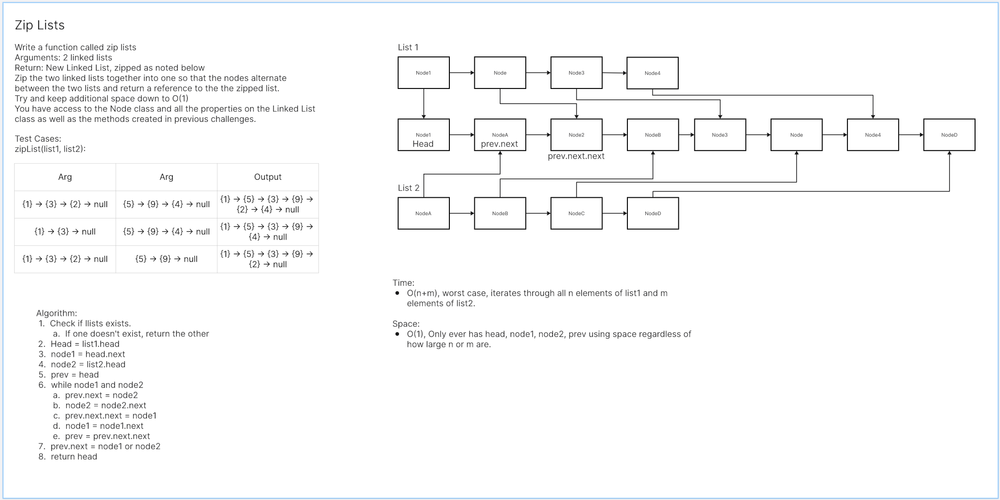

# Linked List
<!-- Description of the challenge -->
Zip two lists together

## Whiteboard Process
<!-- Embedded whiteboard image -->


## Approach & Efficiency
<!-- What approach did you take? Why? What is the Big O space/time for this approach? -->
I'm sure I took a rather simple approach. Nodes connect to each other upon insert.

Big O:

- zip_lists:
  - Time: O(n+m)
  - Space: Constant

## Solution
<!-- Show how to run your code, and examples of it in action -->
```
from code_challenges.linked_list.linked_list import Linked_List as LinkedList

def zip_lists(list1, list2):
    if not list2.head:
        return list1
    if not list1.head:
        return list2
    
    list = LinkedList()
    head = list1.head
    node1 = head.next
    node2 = list2.head
    prev = head
    while node1 and node2:
        prev.next = node2
        node2 = node2.next
        prev.next.next = node1
        node1 = node1.next
        prev = prev.next.next
    prev.next = node1 or node2
    list.head = head
    return list
```
Tests:
```
import pytest
from code_challenges.linked_list_zip.linked_list_zip import zip_lists
from code_challenges.linked_list.linked_list import Linked_List as LinkedList


def test_exists():
    assert zip_lists


# @pytest.mark.skip("TODO")
def test_even_length():
    list_a = LinkedList()
    for value in reversed([1, 2, 3]):
        list_a.insert(value)

    list_b = LinkedList()
    for value in reversed(["a", "b", "c"]):
        list_b.insert(value)

    actual = zip_lists(list_a, list_b)
    expected = LinkedList()
    for value in reversed([1, "a", 2, "b", 3, "c"]):
        expected.insert(value)

    assert str(actual) == str(expected)


# @pytest.mark.skip("TODO")
def test_a_shorter():
    list_a = LinkedList()
    for value in reversed([1, 2]):
        list_a.insert(value)

    list_b = LinkedList()
    for value in reversed(["a", "b", "c"]):
        list_b.insert(value)

    actual = zip_lists(list_a, list_b)
    expected = LinkedList()
    for value in reversed([1, "a", 2, "b", "c"]):
        expected.insert(value)

    assert str(actual) == str(expected)


# @pytest.mark.skip("TODO")
def test_b_shorter():
    list_a = LinkedList()
    for value in reversed([1, 2, 3]):
        list_a.insert(value)

    list_b = LinkedList()
    for value in reversed(["a", "b"]):
        list_b.insert(value)

    actual = zip_lists(list_a, list_b)
    expected = LinkedList()
    for value in reversed([1, "a", 2, "b", 3]):
        expected.insert(value)

    assert str(actual) == str(expected)


# @pytest.mark.skip("TODO")
def test_a_empty():
    list_a = LinkedList()
    list_b = LinkedList()
    for value in reversed(["a", "b", "c"]):
        list_b.insert(value)

    actual = zip_lists(list_a, list_b)
    expected = LinkedList()
    for value in reversed(["a", "b", "c"]):
        expected.insert(value)
    assert str(actual) == str(expected)


# @pytest.mark.skip("TODO")
def test_b_empty():
    list_a = LinkedList()
    for value in reversed([1, 2, 3]):
        list_a.insert(value)
    list_b = LinkedList()
    actual = zip_lists(list_a, list_b)
    expected = LinkedList()
    for value in reversed([1, 2, 3]):
        expected.insert(value)
    assert str(actual) == str(expected)

```