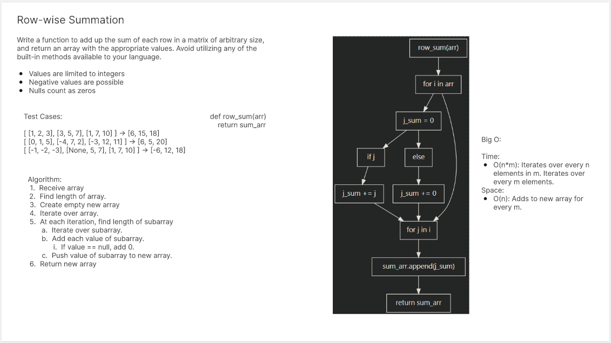

# Matrix Row Summation
<!-- Description of the challenge -->
Given a matrix, find the sum of each row.

## Whiteboard Process
<!-- Embedded whiteboard image -->


## Approach & Efficiency
<!-- What approach did you take? Why? What is the Big O space/time for this approach? -->
I double for looped because it seemed the simplest.
Time complexity is O(n) to O(n^2) depending on the size of the matrix.
Space complexity is O(n).

## Solution
<!-- Show how to run your code, and examples of it in action -->

```
def row_sum(arr):
    sum_arr = []
    for i in arr:
        j_sum = 0
        for j in i:
            if j:
                j_sum += j
            else:
                j_sum += 0
        sum_arr.append(j_sum)
    return sum_arr
```