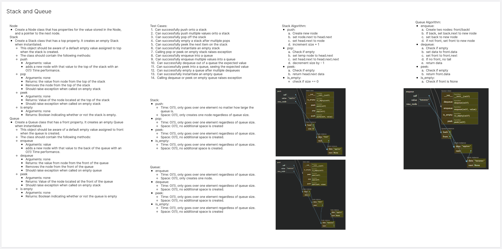
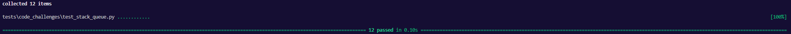

# Stack and Queue
<!-- Description of the challenge -->
Implement Stack and Queue classes.

## Whiteboard Process
<!-- Embedded whiteboard image -->


## Approach & Efficiency
<!-- What approach did you take? Why? What is the Big O space/time for this approach? -->

Big O:

Stack:

- push:
  - Time: Constant
  - Space: Constant
- pop:
  - Time: Constant
  - Space: Constant
- peek:
  - Time: Constant
  - Space: Constant
- is_empty:
  - Time: Constant
  - Space: Constant

Queue:
- enqueue:
  - Time: Constant
  - Space: Constant
- dequeue:
  - Time: Constant
  - Space: Constant
- peek:
  - Time: Constant
  - Space: Constant
- is_empty:
  - Time: Constant
  - Space: Constant

## Solution
<!-- Show how to run your code, and examples of it in action -->
```
class Node:
  def __init__(self, data, next=None):
    self.data = data
    self.next =  next

class Stack:
  def __init__(self):
    self.head = Node("head")
    self.size = 0

  def is_empty(self):
    return self.size == 0
  
  def push(self, value):
    new_node = Node(value)
    new_node.next = self.head.next
    self.head.next = new_node
    self.size += 1

  def pop(self):
    if self.is_empty():
      raise Exception("Ain't nothing here")
    remove = self.head.next
    self.head.next = self.head.next.next
    self.size -= 1
    return remove.data
  
  def peek(self):
    if self.is_empty():
      raise Exception("Nothing to see here")
    return self.head.next.data
  
class Queue:
  def __init__(self):
    self.front = None
    self.back = None

  def is_empty(self):
    return self.front is None
  
  def enqueue(self, value):
    new_node = Node(value)
    if self.back:
      self.back.next = new_node
    self.back = new_node
    if not self.front:
      self.front = new_node

  def dequeue(self):
    if self.is_empty():
      raise IndexError("There's nothing here")
    data = self.front.data
    self.front = self.front.next
    if self.front is None:
      self.tail = None
    return data
  
  def peek(self):
    if self.is_empty():
      raise Exception("Nothing to see here")
    return self.front.data

```
Tests:
```
def test_push_one():
  stack = Stack()
  stack.push("apples")
  actual = stack.pop()
  expected = "apples"
  assert actual == expected

def test_push_two():
  stack = Stack()
  stack.push("apples")
  stack.push("bananas")

  actual = stack.pop()
  expected = "bananas"
  assert actual == expected

  actual = stack.pop()
  expected = "apples"
  assert actual == expected

def test_peek_stack():
  stack = Stack()
  stack.push("apples")
  stack.push("bananas")

  actual = stack.peek()
  expected = "bananas"
  assert actual == expected

def test_empty_stack():
  stack = Stack()
  stack.push("apples")
  stack.push("bananas")
  stack.push("oranges")
  stack.pop()
  stack.pop()
  stack.pop()

  actual = stack.is_empty()
  expected = True
  assert actual == expected

def test_peek_error_stack():
  stack = Stack()
  with pytest.raises(Exception):
    stack.peek()

def test_pop_error_stack():
  stack = Stack()
  with pytest.raises(Exception):
    stack.pop()

def test_enqueue_one():
  queue = Queue()
  queue.enqueue("apples")
  actual = queue.dequeue()
  expected = "apples"
  assert actual == expected

def test_enqueue_two():
  queue = Queue()
  queue.enqueue("apples")
  queue.enqueue("bananas")

  actual = queue.dequeue()
  expected = "apples"
  assert actual == expected

  actual = queue.dequeue()
  expected = "bananas"
  assert actual == expected

def test_peek_queue():
  queue = Queue()
  queue.enqueue("First")
  queue.enqueue("Second")

  actual = queue.peek()
  expected = "First"
  assert actual == expected

def test_empty_queue():
  queue = Queue()
  queue.enqueue("First")
  queue.enqueue("Second")
  queue.enqueue("Third")

  queue.dequeue()
  queue.dequeue()
  queue.dequeue()

  actual = queue.is_empty()
  expected = True
  assert actual == expected

def test_peek_error_queue():
  queue = Queue()
  with pytest.raises(Exception):
    queue.peek()

def test_dequeue_error_queue():
  queue = Queue()
  with pytest.raises(IndexError):
    queue.dequeue()
```
