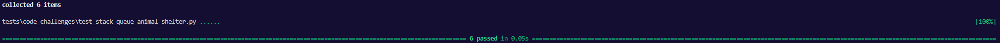

# Animal Shelter
<!-- Description of the challenge -->
First-in, First out Animal Shelter.

## Whiteboard Process
<!-- Embedded whiteboard image -->


## Approach & Efficiency
<!-- What approach did you take? Why? What is the Big O space/time for this approach? -->

Big O:
- enqueue:
  - Time: Constant
  - Space: Constant
- dequeue:
  - Time: O(n)
  - Space: O(n)

## Solution
<!-- Show how to run your code, and examples of it in action -->
```
class AnimalShelter:
    def __init__(self):
        self.animals = Queue()
        self.cats = Queue()
        self.dogs = Queue()
    
    def enqueue(self, animal):
        self.animals.enqueue(animal)
        if animal.species == 'cat':
            self.cats.enqueue(animal)
        elif animal.species == 'dog':
            self.dogs.enqueue(animal)
        else:
            raise TypeError("We only hold cats and dogs here")

    def dequeue(self, pref):
        if pref not in ['dog', 'cat']:
            return None

        species_queue = self.dogs if pref == 'dog' else self.cats
        if species_queue.is_empty():
            raise ValueError(f"There ain't no {pref} in here.")
        
        target = species_queue.dequeue()
        target_id = id(target)
        temp = Queue()

        while not self.animals.is_empty():
            animal = self.animals.dequeue()
            if id(animal) != target_id:
                temp.enqueue(animal)
        self.animals = temp
        
        return target
        
class Dog:
    def __init__(self, name=None):
        self.species = 'dog'
        self.name = name
    @staticmethod
    def the_dog_goes():
        print("Woof")
    def __str__(self):
        return f"Dog: {self.name}"
    def __repr__(self):
        return f"Dog('{self.name}')"

class Cat:
    def __init__(self, name=None):
        self.species = 'cat'
        self.name = name
    @staticmethod
    def the_cat_goes():
        print("Meow")
    def __str__(self):
        return f"Cat: {self.name}"
    def __repr__(self):
        return f"Cat('{self.name}')"
```
Tests:
```
def test_single_cat():
    shelter = AnimalShelter()
    cat = Cat()
    shelter.enqueue(cat)
    actual = shelter.dequeue("cat")
    expected = cat
    assert actual == expected

def test_single_dog():
    shelter = AnimalShelter()
    dog = Dog()
    shelter.enqueue(dog)
    actual = shelter.dequeue("dog")
    expected = dog
    assert actual == expected

def test_dog_preferred_but_cat_in_front():
    shelter = AnimalShelter()
    cat = Cat()
    dog = Dog()
    shelter.enqueue(cat)
    shelter.enqueue(dog)
    actual = shelter.dequeue("dog")
    expected = dog
    assert actual == expected

def test_dog_then_cat():
    shelter = AnimalShelter()
    cat = Cat()
    dog = Dog()
    shelter.enqueue(dog)
    shelter.enqueue(cat)
    shelter.dequeue("dog")
    actual = shelter.dequeue("cat")
    expected = cat
    assert actual == expected

def test_dog_preferred_but_cat_in_front_twice():
    shelter = AnimalShelter()
    cat = Cat()
    dog = Dog()
    shelter.enqueue(cat)
    shelter.enqueue(dog)
    actual = shelter.dequeue("dog")
    expected = dog
    assert actual == expected
    with pytest.raises(ValueError):
        shelter.dequeue("dog")

def test_bad_pref():
    shelter = AnimalShelter()
    cat = Cat()
    dog = Dog()
    shelter.enqueue(dog)
    shelter.enqueue(cat)
    shelter.dequeue("dog")
    actual = shelter.dequeue("lizard")
    expected = None
    assert expected == actual

```
