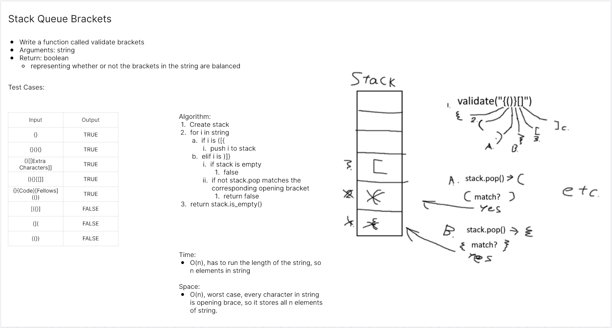

# Bracket Validation
<!-- Description of the challenge -->
Multi-bracket Validation.

## Whiteboard Process
<!-- Embedded whiteboard image -->


## Approach & Efficiency
<!-- What approach did you take? Why? What is the Big O space/time for this approach? -->

Big O:

- Time: O(n)
- Space: O(n)

## Solution
<!-- Show how to run your code, and examples of it in action -->
```
def multi_bracket_validation(str):
    open_stack = Stack()
    for i in str:
        if i in '([{':
            open_stack.push(i)
        elif i in ')]}':
            if open_stack.is_empty():
                return False
            top = open_stack.pop()
            if not ((i == ')' and ord(top) == ord(i) - 1) or
                    (i in '}]' and ord(top) == ord(i) - 2)):
                return False
    return open_stack.is_empty()
```
Tests:
```
def test_single_cat():
    shelter = AnimalShelter()
    cat = Cat()
    shelter.enqueue(cat)
    actual = shelter.dequeue("cat")
    expected = cat
    assert actual == expected

def test_single_dog():
    shelter = AnimalShelter()
    dog = Dog()
    shelter.enqueue(dog)
    actual = shelter.dequeue("dog")
    expected = dog
    assert actual == expected

def test_dog_preferred_but_cat_in_front():
    shelter = AnimalShelter()
    cat = Cat()
    dog = Dog()
    shelter.enqueue(cat)
    shelter.enqueue(dog)
    actual = shelter.dequeue("dog")
    expected = dog
    assert actual == expected

def test_dog_then_cat():
    shelter = AnimalShelter()
    cat = Cat()
    dog = Dog()
    shelter.enqueue(dog)
    shelter.enqueue(cat)
    shelter.dequeue("dog")
    actual = shelter.dequeue("cat")
    expected = cat
    assert actual == expected

def test_dog_preferred_but_cat_in_front_twice():
    shelter = AnimalShelter()
    cat = Cat()
    dog = Dog()
    shelter.enqueue(cat)
    shelter.enqueue(dog)
    actual = shelter.dequeue("dog")
    expected = dog
    assert actual == expected
    with pytest.raises(ValueError):
        shelter.dequeue("dog")

def test_bad_pref():
    shelter = AnimalShelter()
    cat = Cat()
    dog = Dog()
    shelter.enqueue(dog)
    shelter.enqueue(cat)
    shelter.dequeue("dog")
    actual = shelter.dequeue("lizard")
    expected = None
    assert expected == actual

```
