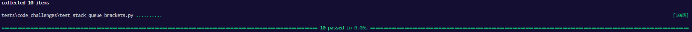

# Bracket Validation
<!-- Description of the challenge -->
Multi-bracket Validation.

## Whiteboard Process
<!-- Embedded whiteboard image -->


## Approach & Efficiency
<!-- What approach did you take? Why? What is the Big O space/time for this approach? -->

Big O:

- Time: O(n)
- Space: O(n)

## Solution
<!-- Show how to run your code, and examples of it in action -->
```
def multi_bracket_validation(str):
    open_stack = Stack()
    for i in str:
        if i in '([{':
            open_stack.push(i)
        elif i in ')]}':
            if open_stack.is_empty():
                return False
            top = open_stack.pop()
            if not ((i == ')' and ord(top) == ord(i) - 1) or
                    (i in '}]' and ord(top) == ord(i) - 2)):
                return False
    return open_stack.is_empty()
```
Tests:
```

def test_validates_two_square_brackets():
    actual = multi_bracket_validation("[]")
    expected = True
    assert actual == expected

def test_fails_two_square_brackets_flipped():
    actual = multi_bracket_validation("][")
    expected = False
    assert actual == expected

def test_validates_two_braces():
    actual = multi_bracket_validation("{}")
    expected = True
    assert actual == expected

def test_fails_two_braces_flipped():
    actual = multi_bracket_validation("}{")
    expected = False
    assert actual == expected

def test_validates_two_parentheses():
    actual = multi_bracket_validation("()")
    expected = True
    assert actual == expected

def test_fails_two_parentheses_flipped():
    actual = multi_bracket_validation(")(")
    expected = False
    assert actual == expected

def test_multi():
    actual = multi_bracket_validation("{}(){}")
    expected = True
    assert actual == expected

def test_nested():
    actual = multi_bracket_validation("{([])}")
    expected = True
    assert actual == expected

def test_mismatched():
    actual = multi_bracket_validation("[}")
    expected = False
    assert actual == expected

def test_extra_characters():
    actual = multi_bracket_validation("()[[Extra Characters]]")
    expected = True
    assert actual == expected
```
