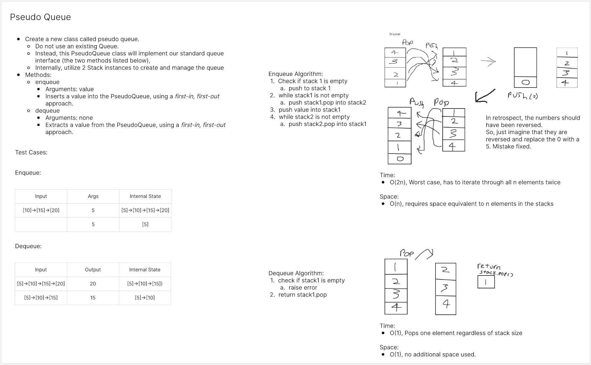

# Pseudo Queue
<!-- Description of the challenge -->
Implement a Queue using two Stacks.

## Whiteboard Process
<!-- Embedded whiteboard image -->


## Approach & Efficiency
<!-- What approach did you take? Why? What is the Big O space/time for this approach? -->

Big O:

enqueue:

- Time: O(2n)
- Space: O(n)

dequeue:

- Time: Constant
- Space: Constant


## Solution
<!-- Show how to run your code, and examples of it in action -->
```
class PseudoQueue:
    
    def __init__(self):
        self.stack1 = Stack()
        self.stack2 = Stack()

    def enqueue(self, value):
        if self.stack1.is_empty():
            self.stack1.push(value)
        else:
            while self.stack1.is_empty() == False:
                self.stack2.push(self.stack1.pop())

            self.stack1.push(value)

            while self.stack2.is_empty() == False:
                self.stack1.push(self.stack2.pop())


    def dequeue(self):
        if self.stack1.is_empty():
            raise IndexError("There's nothing here")
        return self.stack1.pop()

```
Tests:
```
def test_exists():
    assert PseudoQueue


# @pytest.mark.skip("TODO")
def test_enqueue_one():
    pq = PseudoQueue()
    pq.enqueue("apples")
    actual = pq.dequeue()
    expected = "apples"
    assert actual == expected


# @pytest.mark.skip("TODO")
def test_enqueue_two():
    pq = PseudoQueue()
    pq.enqueue("apples")
    pq.enqueue("bananas")

    actual = pq.dequeue()
    expected = "apples"
    assert actual == expected

    actual = pq.dequeue()
    expected = "bananas"
    assert actual == expected


# @pytest.mark.skip("TODO")
def test_enqueue_dequeue_enqueue_dequeue():
    pq = PseudoQueue()
    pq.enqueue("apples")
    pq.enqueue("bananas")

    pq.dequeue()

    pq.enqueue("cucumbers")
    pq.enqueue("dates")

    actual = [pq.dequeue(), pq.dequeue(), pq.dequeue()]

    expected = ["bananas", "cucumbers", "dates"]

    assert actual == expected

```
