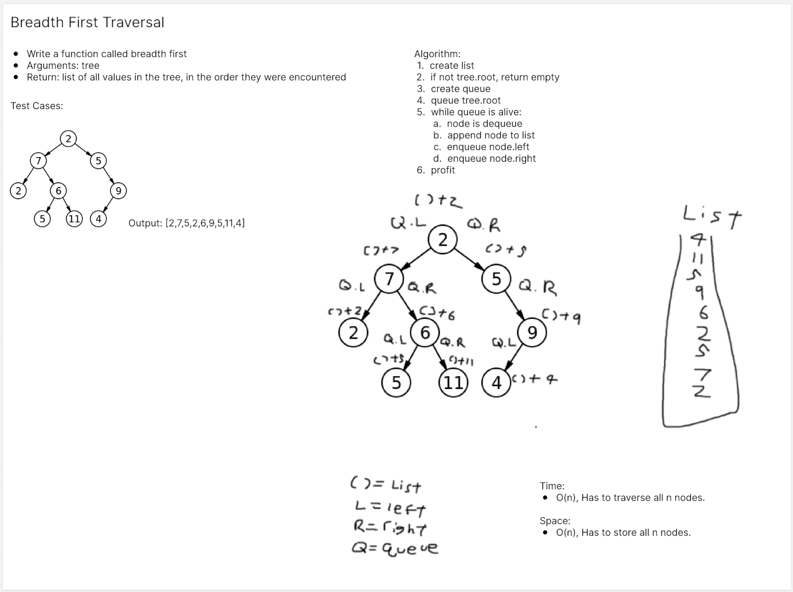

# Tree Breadth First
<!-- Description of the challenge -->
Breadth-first Traversal.

## Whiteboard Process
<!-- Embedded whiteboard image -->


## Approach & Efficiency
<!-- What approach did you take? Why? What is the Big O space/time for this approach? -->

Big O:

- Time: O(n)
- Space: O(n)

## Solution
<!-- Show how to run your code, and examples of it in action -->
```
def breadth_first(tree):
    list = []
    if not tree.root:
        return list
    queue = Queue()
    queue.enqueue(tree.root)

    while not queue.is_empty():
        node = queue.dequeue()
        list.append(node.data)

        if node.left:
            queue.enqueue(node.left)
        if node.right:
            queue.enqueue(node.right)

    return list
```
Tests:
```
# @pytest.mark.skip("TODO")
def test_exists():
    assert breadth_first


# @pytest.mark.skip("TODO")
def test_rootless_tree():
    tree = BinaryTree()
    expected = []
    actual = breadth_first(tree)
    assert actual == expected


# @pytest.mark.skip("TODO")
def test_single_node():
    tree = BinaryTree()
    tree.root = Node("apples")
    expected = ["apples"]
    actual = breadth_first(tree)
    assert actual == expected


# @pytest.mark.skip("TODO")
def test_two_nodes():
    tree = BinaryTree()
    tree.root = Node("apples")
    tree.root.right = Node("bananas")
    expected = ["apples", "bananas"]
    actual = breadth_first(tree)
    assert actual == expected


# @pytest.mark.skip("TODO")
def test_four_nodes():
    tree = BinaryTree()
    tree.root = Node("apples")
    tree.root.left = Node("bananas")
    tree.root.right = Node("cucumbers")
    tree.root.right.right = Node("dates")
    expected = ["apples", "bananas", "cucumbers", "dates"]
    actual = breadth_first(tree)
    assert actual == expected


# @pytest.mark.skip("TODO")
def test_example_from_reading():
    """
    We build these out by hand because the example has some gaps
    i.e. it is not added to left-to-right

                            2
                7                   5
        2               6                       9
                    5       11              4

    result = [2,7,5,2,6,9,5,11,4]
    """
    tree = BinaryTree()

    level_0 = Node(2)
    level_1_first = Node(7)
    level_1_second = Node(5)

    level_2_first = Node(2)
    level_2_second = Node(6)
    level_2_third = Node(9)

    level_3_first = Node(5)
    level_3_second = Node(11)
    level_3_third = Node(4)

    tree.root = level_0
    level_0.left = level_1_first
    level_0.right = level_1_second
    level_1_first.left = level_2_first
    level_1_first.right = level_2_second
    level_1_second.right = level_2_third

    level_2_second.left = level_3_first
    level_2_second.right = level_3_second

    level_2_third.right = level_3_third

    expected = [2, 7, 5, 2, 6, 9, 5, 11, 4]
    actual = breadth_first(tree)

    assert actual == expected
```
