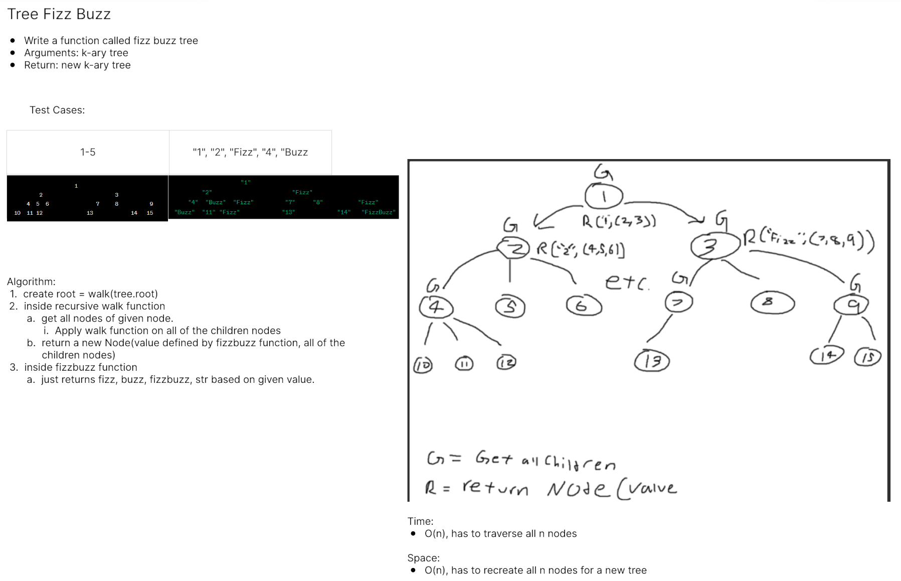
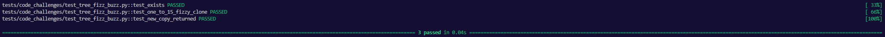

# Tree Fizz Buzz
<!-- Description of the challenge -->
Conduct “FizzBuzz” on a k-ary tree while traversing through it to create a new tree.

## Whiteboard Process
<!-- Embedded whiteboard image -->


## Approach & Efficiency
<!-- What approach did you take? Why? What is the Big O space/time for this approach? -->

Big O:

- Time: O(n)
- Space: O(n)

## Solution
<!-- Show how to run your code, and examples of it in action -->
```
def test_exists():
    assert fizz_buzz_tree


# @pytest.mark.skip("TODO")
def test_one_to_15_fizzy_clone(tree):

    fizzy_tree = fizz_buzz_tree(tree)

    actual = fizzy_tree.breadth_first()

    expected = [
        "1",
        "2",
        "Fizz",
        "4",
        "Buzz",
        "Fizz",
        "7",
        "8",
        "Fizz",
        "Buzz",
        "11",
        "Fizz",
        "13",
        "14",
        "FizzBuzz",
    ]

    assert actual == expected


# @pytest.mark.skip("TODO")
def test_new_copy_returned(tree):

    fizz_buzz_tree(tree)

    actual = tree.breadth_first()

    expected = [
        1,
        2,
        3,
        4,
        5,
        6,
        7,
        8,
        9,
        10,
        11,
        12,
        13,
        14,
        15,
    ]

    assert actual == expected


@pytest.fixture
def tree():
    one = Node(1)
    two = Node(2)
    three = Node(3)
    four = Node(4)
    five = Node(5)
    six = Node(6)
    seven = Node(7)
    eight = Node(8)
    nine = Node(9)
    ten = Node(10)
    eleven = Node(11)
    twelve = Node(12)
    thirteen = Node(13)
    fourteen = Node(14)
    fifteen = Node(15)

    """
                            1
                2                       3
            4  5  6               7     8          9
        10  11 12              13            14   15
    """

    one.children = [two, three]
    two.children = [four, five, six]
    three.children = [seven, eight, nine]
    four.children = [ten]
    five.children = [eleven]
    six.children = [twelve]
    seven.children = [thirteen]
    nine.children = [fourteen, fifteen]

    return KaryTree(one)
```
