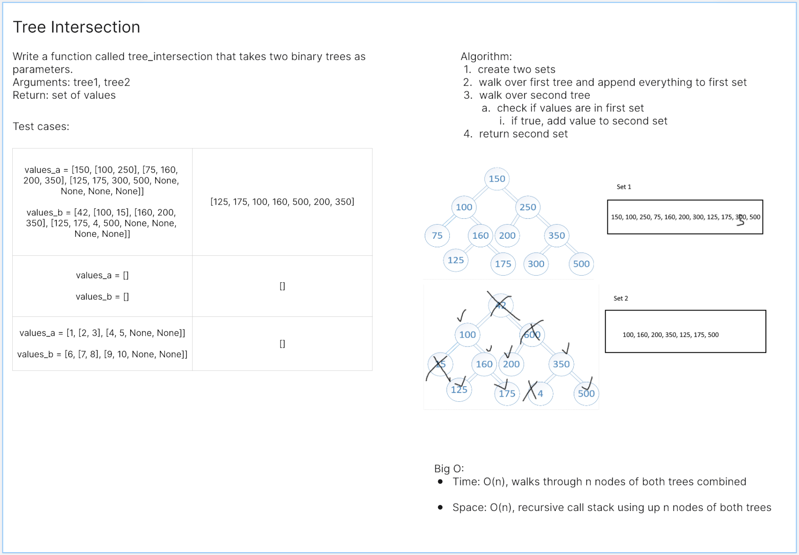
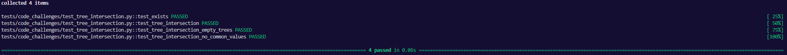

# Tree Intersection
<!-- Description of the challenge -->
Find common values in 2 binary trees.

## Whiteboard Process
<!-- Embedded whiteboard image -->


## Approach & Efficiency
<!-- What approach did you take? Why? What is the Big O space/time for this approach? -->

Big O:

- Time: O(n)
- Space: O(n)

## Solution
<!-- Show how to run your code, and examples of it in action -->
```
def tree_intersection(tree1, tree2):
    seen1 = set()
    seen2 = set()
    def walk(node, is_first_tree):
        if not node:
            return
        if is_first_tree:
            seen1.add(node.data)
        elif node.data in seen1:
            seen2.add(node.data)
        walk(node.left, is_first_tree)
        walk(node.right, is_first_tree)

    walk(tree1.root, True)
    walk(tree2.root, False)
    return seen2
```

Tests:
```
def test_exists():
    assert tree_intersection


# @pytest.mark.skip("TODO")
def test_tree_intersection():

    tree_a = BinaryTree()
    values = [150, 100, 250, 75, 160, 200, 350, 125, 175, 300, 500]
    add_values_to_empty_tree(tree_a, values)

    tree_b = BinaryTree()
    values = [42, 100, 100, 15, 160, 200, 350, 125, 175, 4, 500]
    add_values_to_empty_tree(tree_b, values)

    actual = tree_intersection(tree_a, tree_b)
    expected = [125, 175, 100, 160, 500, 200, 350]

    assert sorted(actual) == sorted(expected)


def add_values_to_empty_tree(tree, values):
    """
    Helper function to add given values to BinaryTree
    """
    tree.root = Node(values.pop())
    q = Queue()

    q.enqueue(tree.root)

    while values:
        node = q.dequeue()
        node.left = Node(values.pop())
        node.right = Node(values.pop()) if values else None
        q.enqueue(node.left)
        q.enqueue(node.right)


def test_tree_intersection_empty_trees():
    tree_a = BinaryTree()
    tree_b = BinaryTree()

    actual = tree_intersection(tree_a, tree_b)
    expected = []

    assert sorted(actual) == sorted(expected)


def test_tree_intersection_no_common_values():
    tree_a = BinaryTree()
    values_a = [1, 2, 3, 4, 5]
    add_values_to_empty_tree(tree_a, values_a)

    tree_b = BinaryTree()
    values_b = [6, 7, 8, 9, 10]
    add_values_to_empty_tree(tree_b, values_b)

    actual = tree_intersection(tree_a, tree_b)
    expected = []

    assert sorted(actual) == sorted(expected)
```
