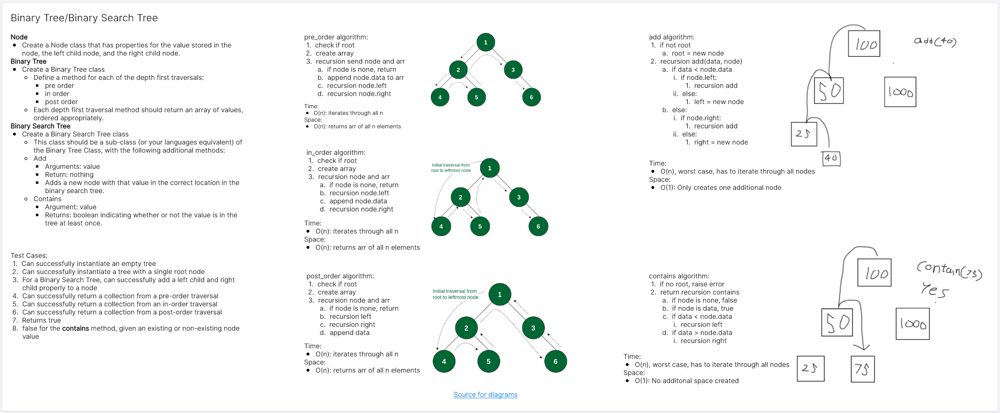
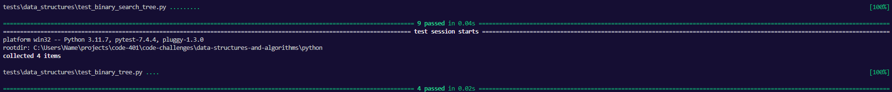

# Binary (Search) Tree
<!-- Description of the challenge -->
Implement a Binary and Binary Search Tree

## Whiteboard Process
<!-- Embedded whiteboard image -->


## Approach & Efficiency
<!-- What approach did you take? Why? What is the Big O space/time for this approach? -->

Big O:
- pre_order:
  - Time: O(n)
  - Space: O(n)
- in_order:
  - Time: O(n)
  - Space: O(n)
- post_order:
  - Time: O(n)
  - Space: O(n)
- add:
  - Time: O(n)
  - Space: O(1)
- contains:
  - Time: O(n)
  - Space: O(1)

## Solution
<!-- Show how to run your code, and examples of it in action -->
Binary Tree
```
class BinaryTree:

    def __init__(self):
        self.root = None

    def pre_order(self):
        if not self.root:
            raise ValueError("Nothing here")
        arr = []
        self._pre_order(self.root, arr)
        return arr

    def _pre_order(self, node, arr):
        if node == None:
            return
        arr.append(node.data)
        self._pre_order(node.left, arr)
        self._pre_order(node.right, arr)

    def in_order(self):
        if not self.root:
            raise ValueError("Nothing here")
        arr = []
        self._in_order(self.root, arr)
        return arr
        
    def _in_order(self, node, arr):
        if node == None:
            return
        self._in_order(node.left, arr)
        arr.append(node.data)
        self._in_order(node.right, arr)

    def post_order(self):
        if not self.root:
            raise ValueError("Nothing here")
        arr = []
        self._post_order(self.root, arr)
        return arr
    
    def _post_order(self, node, arr):
        if node == None:
            return
        self._post_order(node.left, arr)
        self._post_order(node.right, arr)
        arr.append(node.data)
            
class Node:
    def __init__(self, data):
        self.left = None
        self.right = None
        self.data = data
```

Binary Search Tree:
```
class BinarySearchTree(BinaryTree):

    def add(self, data):
        if not self.root:
            self.root = Node(data)
        else:
            self._add(data, self.root)

    def _add(self, data, node):
        if data < node.data:
            if node.left:
                self._add(data, node.left)
            else:
                node.left = Node(data)
        else:
            if node.right:
                self._add(data, node.right)
            else:
                node.right = Node(data)

    def contains(self, data):
        if self.root == None:
            raise IndexError("Empty tree")
        return self._contains(data, self.root)
    
    def _contains(self, data, node):
        if node is None:
            return False
        if data == node.data:
            return True
        elif data < node.data:
            return self._contains(data, node.left)
        elif data > node.data:
            return self._contains(data, node.right)
```

Binary Tree Tests:
```

def test_exists():
    assert BinaryTree

def test_pre_order(tree):
    actual = tree.pre_order()
    expected = ["a", "b", "d", "e", "c", "f", "g"]
    assert actual == expected

def test_in_order(tree):
    actual = tree.in_order()
    expected = ["d", "b", "e", "a", "f", "c", "g"]
    assert actual == expected

def test_post_order(tree):
    actual = tree.post_order()
    expected = ["d", "e", "b", "f", "g", "c", "a"]
    assert actual == expected

@pytest.fixture
def tree():
    """
          a
      b      c
    d  e    f  g
    """

    tree = BinaryTree()

    tree.root = Node("a")
    tree.root.left = Node("b")
    tree.root.right = Node("c")
    tree.root.left.left = Node("d")
    tree.root.left.right = Node("e")
    tree.root.right.left = Node("f")
    tree.root.right.right = Node("g")

    return tree


```

Binary Search Tree Tests:
```
def test_exists():
    assert BinarySearchTree

def test_instantiate_empty():
    tree = BinarySearchTree()
    actual = tree.root
    expected = None
    assert actual == expected

def test_add_to_empty():
    tree = BinarySearchTree()
    tree.add("apples")
    actual = tree.root.data
    expected = "apples"
    assert actual == expected

def test_add_left():
    tree = BinarySearchTree()
    tree.add(10)
    tree.add(5)
    actual = tree.root.left.data
    expected = 5
    assert actual == expected

def test_add_right():
    tree = BinarySearchTree()
    tree.add(10)
    tree.add(15)
    actual = tree.root.right.data
    expected = 15
    assert actual == expected

def test_add_deeper(tree):
    tree.add(25)
    actual = tree.root.right.right.data
    expected = 25
    assert actual == expected

def test_contains(tree):
    actual = tree.contains(15)
    expected = True
    assert actual == expected

def test_contains_deeper(tree):
    actual = tree.contains(5)
    expected = True
    assert actual == expected

def test_not_contains(tree):
    actual = tree.contains(100)
    expected = False
    assert actual == expected

@pytest.fixture
def tree():
    tree = BinarySearchTree()
    tree.add(10)
    tree.add(5)
    tree.add(15)
    return tree
```
