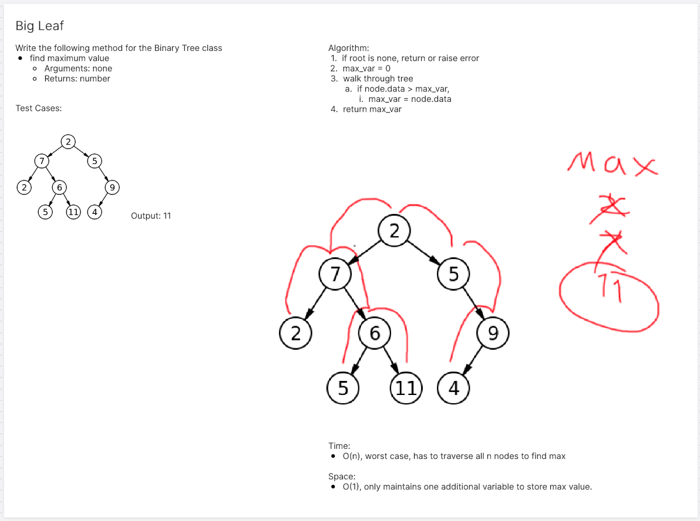
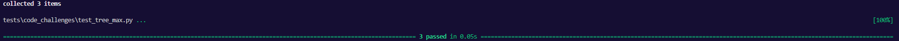

# Max Binary Tree
<!-- Description of the challenge -->
Find the biggest leaf

## Whiteboard Process
<!-- Embedded whiteboard image -->


## Approach & Efficiency
<!-- What approach did you take? Why? What is the Big O space/time for this approach? -->

Big O:
- Time: O(n)
- Space: O(1)

## Solution
<!-- Show how to run your code, and examples of it in action -->
get_max method inside binary tree
```
def get_max(self):
        if self.root is None:
            return float('-inf')
        max_val = self.root.data

        def search(node):
            nonlocal max_val
            if not node:
                return
            max_val = max(max_val, node.data)
            search(node.left)
            search(node.right)

        search(self.root)

        return max_val
```

Tests
```
def test_max_val():
    tree = BinaryTree()
    tree.root = Node(10)
    tree.root.left = Node(30)
    tree.root.right = Node(-7)

    actual = tree.get_max()
    expected = 30

    assert actual == expected

def test_max_val_negative_numbers():
    tree = BinaryTree()
    tree.root = Node(-5)
    tree.root.left = Node(-10)
    tree.root.right = Node(-3)

    actual = tree.get_max()
    expected = -3

    assert actual == expected

def test_max_val_empty_tree():
    tree = BinaryTree()

    actual = tree.get_max()
    expected = float('-inf')

    assert actual == expected
```
